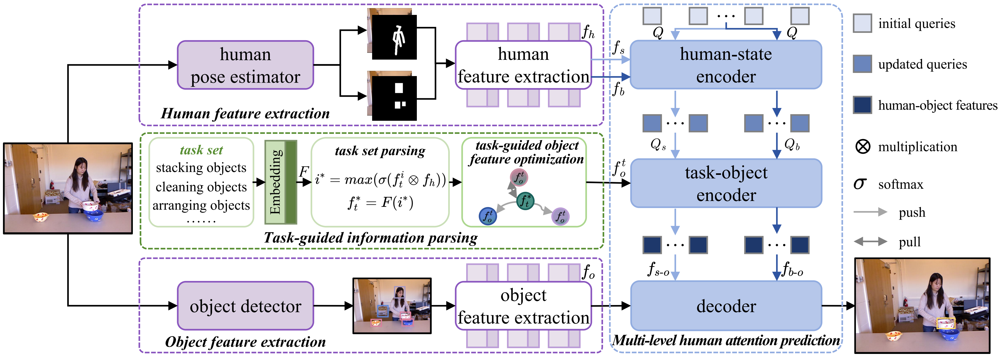

<h2 align="center">
  <a href="https://ieeexplore.ieee.org/abstract/document/10794598">
    Human Attention Prediction in Unconstrained Scenes via Task Set Parsing
  </a>
</h2>
<h4 align="center" color="A0A0A0"> Tao Xiang, Leiyu Jia, Fulin Luo, Tianfei Zhou, Zhixiong Nan* </h4>
<h5 align="center"> If you like our project, please give us a star ⭐ on GitHub for the latest update.</h5>

# THA
This is the official implementation of the paper "[Human Attention Prediction in Unconstrained Scenes via Task Set Parsing](https://ieeexplore.ieee.org/abstract/document/10794598)".

  

 

Given its interdisciplinary research significance, the study of human attention dates back to the fourth century in philosophy and continues to be intensively explored in psychology and cognitive science. While a series of researches across these domains have definitely demonstrated that human attention allocation is governed by high-level task demands, existing studies in computer science community commonly persist in adopting bottom-up data-driven approaches for visual attention prediction, ignoring to incorporate critical task-in-mind information into computational models. Although a few works recognize the importance of task-guiding-attention, the task is usually modeled in simple manners or directly assumed known as the input. To resolve this dilemma encountered in current research, this paper proposes a Task-guided Human Attention prediction model (**THA**), whose core Task-Guided Information Parsing (**TIP**) module parses task information from the task set and learns task-object context for attention prediction. Furthermore, **THA** introduces a Multi-Level Human Attention Prediction module with a cascaded encoder structure to progressively integrate human-state cues and task-object context.
When comparing with the existing SOTA model on three public benchmarks (i.e., CAD-120, TIA, and GazeFollow), our model exhibits impressive performance, achieving **-15\% ADist.** and **-29\% AAng** on CAD-120, **-29\% ADist.** and **-36\% AAng.** on TIA, and **+1.6\% AUC** on GazeFollow.
